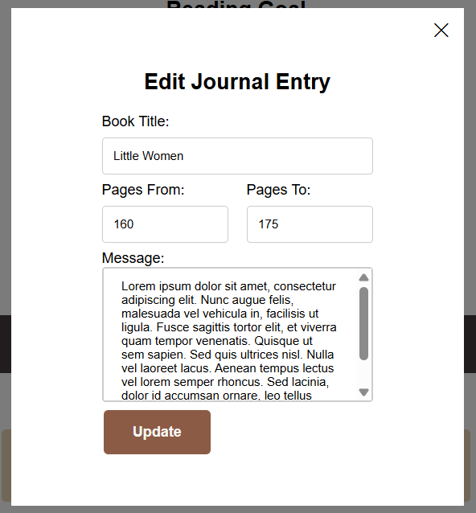
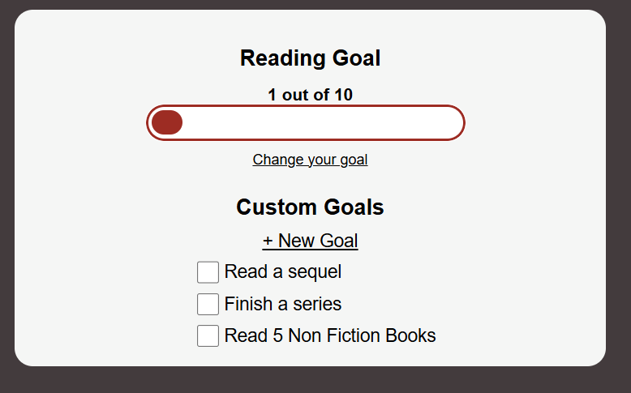
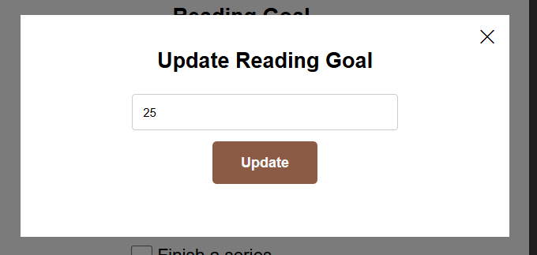
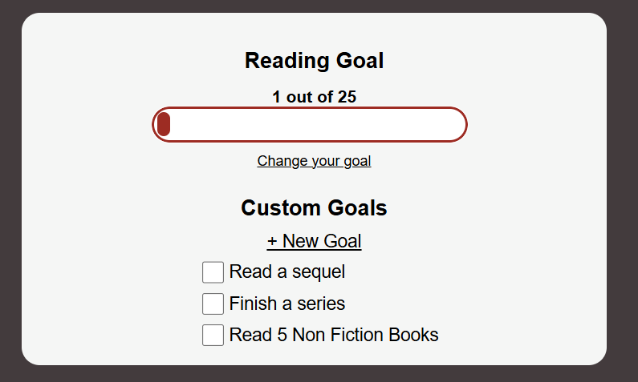
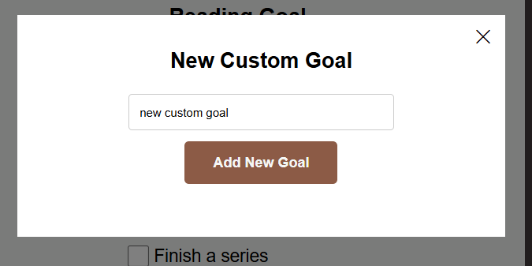
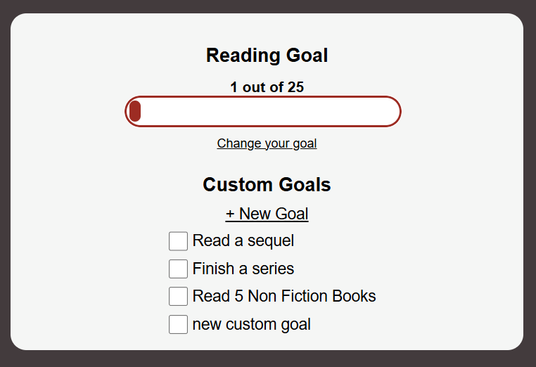
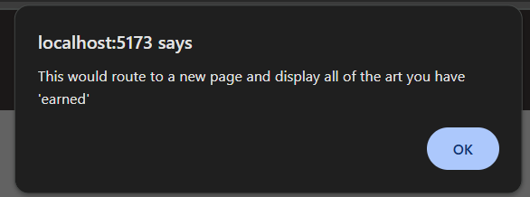

# What is this project?
This is a journal for a user to track their reading. As they continue to complete their goals, they will earn a "painting" to put in their digital gallery.

# Interface
## Current User Features
### View a Journal Entry
The home pages shows the user the 5 most recent journal entries. To view any journal entry, click on the title of the book.

A view with the journal entry opens in a popup. Click the 'X' at the top of the screen to exit the view.

### Edit a Journal Entry
To edit a journal entry, click the pencil symbol in the top right corner of the journal entry you want to edit. A popup will open and will allow you to edit and update the entry. Note that you can only update the pages to and message entry, not the title or pages from.

### View and Change Overall Reading Goal
This is the user's main goal view. Here, you can see the user's reading goal for the year along with a progress bar.

If the user wants to change their goal, they can click "Change your goal" which will open a popup where the user can enter a new goal.

The goal view will update with the user's new goal.

### Add Custom Reading Goals
If the user clicks "+New goal" a popup will open where a user can enter a new custom goal.

When the user submits the new goal, their custom goal list will update.

### Gallery
The user can hover over the info symbol next to the gallery header to get info about what the "Gallery" is and how you can earn "paintings".

You can click on the Gallery and it would theoretically open a new page for the user to view all of their "paintings". However, for now it displays an alert.

# Design Work
## Interview
## Sketching
##

# Implimentation
##
## Styling
All icons used were taken from [Bootstrap Icons](https://icons.getbootstrap.com/).

Styling for text input boxes, popups, and overlays inspired by [w3schools](https://www.w3schools.com/css/default.asp).

# Future Work
One item I tried to include was the ability to search for a book rather than having to manually enter all of the details. However, the API I was using stopped working and I did not have time to fix the feature. This would be one of the first things I would fix in the future.

In addition, there are certain features that, while would work, do not currently have any functionality. An example of this is the "see older entries" button on in the "Journal Entries" section. Currently, this button just triggers an alert that tells the user what this button would do. These are features I would take the time to go in and add actual functionality to.

